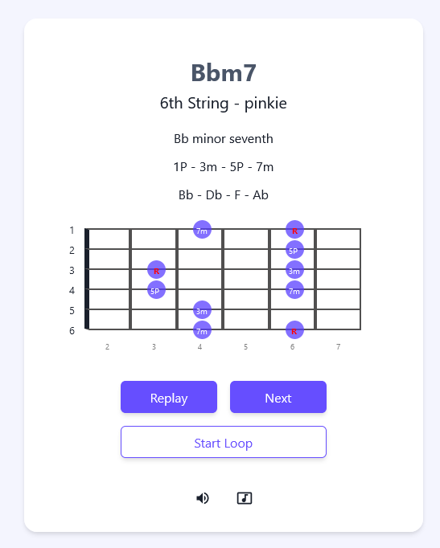
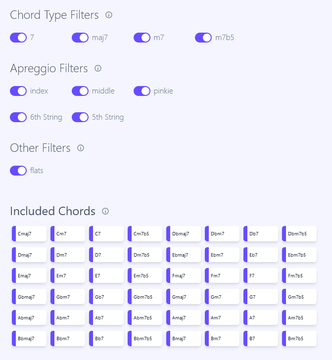

[**Arpeggio Practice Tool**](https://arpeggio-practice-tool.vercel.app/) is a NextJS web app created to help in the arpeggio learning and practice process on the guitar. An *arpeggio* is a broken chord, or a chord in which individual notes are struck one by one, rather than all together at once. As there are many types of chords there are many arpeggios, therefore, when learning arpeggios on the guitar you must know which notes compose the chords and where to play them. This usually takes a lot of practice.

The idea behind this app is pretty simple: it will randomly play an arpeggio from a set of predefined chords, and it will display a diagram with its intervals and how to play it on the fretboard of the guitar. This way, the users can play along random arpeggios on its guitar, with the app helping them by showing how it sounds and how to play it.

###The Arpeggio Player

The arpeggio player not only displays the arpeggio information and its fretboard diagram, but also plays the sound of the notes of which it is made up. You can play a random arpeggio from the list of available chords and replay it if you need to listen to it again. It also allows to automatically play a new chord every 5 seconds.

Lastly, you can configure the player to play all the notes sequentially (as an arpeggio) or together (as a chord), and even mute the player.

###Chord Filters

The app has a filter's section that allows the user to select the chords that can be randomly played, based on chord types (major, minor, dominant or diminished) and if flat chords are allowed. It also has filters regarding which finger and string should the arpeggios start in when being displayed in the fretboard diagram. The user can even modify the chord list by toggling chords individually.

###used libraries

- NextJS - [https://nextjs.org/](https://nextjs.org/)
- ChakraUI - [https://chakra-ui.com/](https://chakra-ui.com/)
- Zustand - [https://github.com/pmndrs/zustand](https://github.com/pmndrs/zustand)
- Tonal - [https://github.com/tonaljs/tonal](https://github.com/tonaljs/tonal)
- HolwerJS - [https://howlerjs.com/](https://howlerjs.com/)

The front-end of this web app is created in React's framework **NextJS**. Since most of the available arpeggios  are calculated from a reduced chord list -which won't change frequently- it does not have a back-end. Instead, it has a JSON file containing the available chords ( 48 combinations ) and the formulas needed to calculate each arpeggio.

The interface is built using **ChakraUI**, a component library that has some nice features like accessibility and theme capability. **Zustand** is used as the state-management solution for this project. 

Since this app relies heavily on the theoretical side of music, the library **Tonal** is used to handle the tonal elements of music theory (notes, intervals, chords, octaves, keys). This beautiful libary does all the heavy lifting when working with chords and its musical components -for example, which are the notes and intervals of a Cmaj7 chord- so we don't have the need to create a huge database with this information.

Lastly, to actually play the sound of the notes, the library **HolwerJS** is used to play mp3 files in the browser. When an arpeggio needs to be played, its notes are calculated and extracted from a big mp3 file containing the sound of all available notes. These notes are then played simultaneously or sequentially using the Holwer's React component.

link to github:
https://github.com/angel208/arpeggio-practice-tool

link to app:
https://arpeggio-practice-tool.vercel.app/

