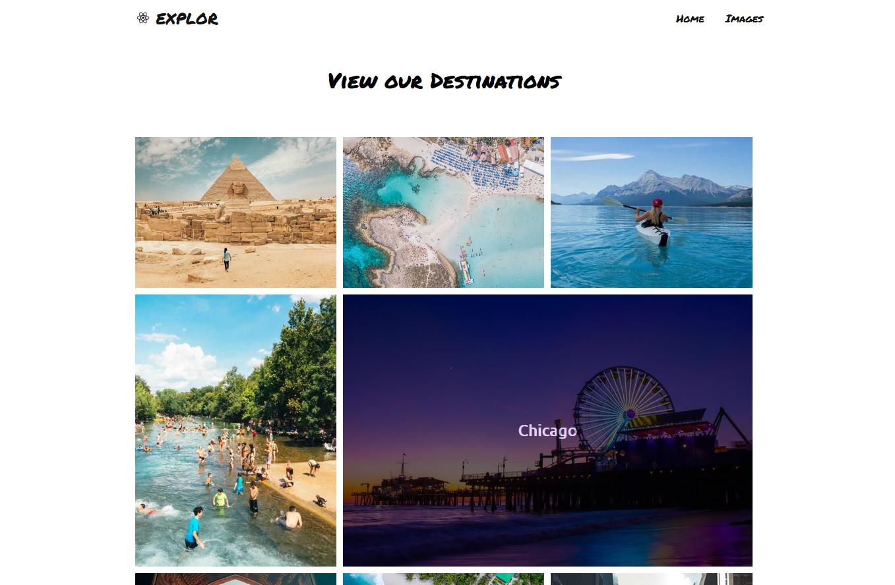
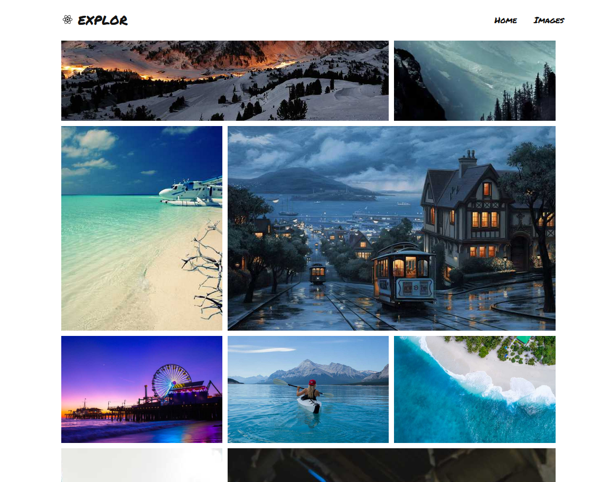

**Explor** is a web app made **GatsbyJS**, a framework for ReactJS. The site consists of a travel-related web page with a gallery of travel photos and a section that contains all the blogposts related to those travels. It was made as part of my ReactJS learning process.

###Blog

When you are making a blogging site, you usually need a CMS (content management system) that allows you to create and edit your posts, maybe through some graphic interface, which can then be consumed by your website. **Explor** does not use a CMS per se but instead looks for all the **Markdown** files inside a certain folder using a GraphQL query. It then fetches and renders them, and lastly, it creates all the post page's HTML at build time, which can then be served to the user. This allows us to have a fully functional blog without the need for a CMS configured and deployed into a separate server.

###Gallery

Similar to the blog section, for the gallery page gatsby runs a GraphQL query to get all the image files inside a specific folder. It then displays all the photos inside the gallery page. One neat benefit of this approach is that, only by uploading more photos to that folder, the gallery is automatically updated to include the new files.  

###Used libraries

- ReactJS - ([https://reactjs.org/](https://reactjs.org/))
- Gatsby - ([https://www.gatsbyjs.com/](https://www.gatsbyjs.com/))
- Transformer-remark -([https://www.gatsbyjs.com/plugins/gatsby-transformer-remark/](https://www.gatsbyjs.com/plugins/gatsby-transformer-remark/))
- Transformer-sharp - ([https://www.gatsbyjs.com/plugins/gatsby-transformer-sharp/](https://www.gatsbyjs.com/plugins/gatsby-transformer-sharp/))

**Explor** is made in **GatsbyJS**.  The gallery and post sections are made using purely **CSS** and its **Grid system**. Both the gallery and the blog use Gastby plugins to process and render its files. These plugins are **Gatsby-transformer-sharp**, which allows processing your images in a variety of ways including resizing, cropping, and creating responsive images; and **Gatsby-transformer-remark** which parses Markdown files.

Link to GitHub: [https://github.com/angel208/Explor](https://github.com/angel208/Explor)