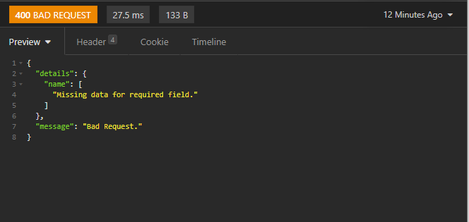
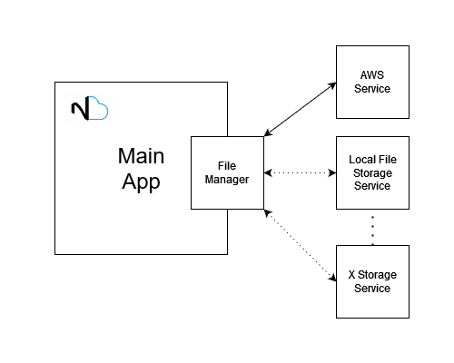
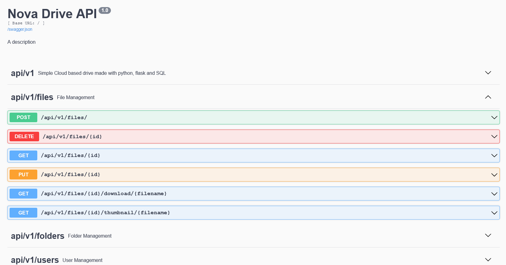

**Nova Drive** is a cloud-based drive made in python. The app consists of an API REST that allows you to store files either in a local file directory or in an AWS S3 bucket. You just need to configure where do you want to store the files and start the service, after that, you will be ready to go.
  
 This first version of the app includes all the basic file manipulation functionalities and user authentication and authorization.  

###REST API

You can access your files through the API Rest of the application. After the service is running, you can access, move, update, delete and edit the files of your drive through the REST methods available. If the file is an image, you can get a thumbnail - which is generated automatically by the app - so you can show a preview of the image to the user.

The rest methods are designed with best practices in mind, and although the API is not 100% RESTful, it draws ideas from the REST APIs of the biggest drive solutions in the market.

All the endpoints are secured using JWT, so the users have access only to its files (and in a future version of the app, the files that are shared with it). Last but not least, the structure of the data that you provide to the endpoints is fully validated, so if a call is missing a field or is not correctly formatted, an HTTP error is thrown accompanied by a message telling you the incorrect field.

###Storage options

The app can be configured to store the files in a directory inside the local file system or in a previously created AWS S3 Bucket. This configuration is made just by changing a few parameters in the config file. 

Even though the local file system and an S3 buckets are the only options available in version 1 of the app, the code is built  in a way that abstracts where is it getting the files from. This means that adding another storage option is possible without touching the app's codebase. 

  

###Database

When building a file storage application, there are two ways of handling the folder hierarchy: 

- the first one is to create that folder structure anywhere the files are being stored. This means that if I call the create folder method in the API, it actually creates the folders inside the s3 bucket or the local file system.

- The second alternative is to store all the files in the same folder or bucket and use some sort of database where all the folder's logical structure is defined. In this case, if I create a folder using the create folder API method, a logical representation of the folder is created in the database, but no folder is actually created in the storage of the app. The relationships between folders and files are also stored in the DB.

Nova cloud uses the second approach to facilitate the integration with other storage options. Because all the heavy lifting of creating a folder hierarchy and managing the relationships between the folders and the files is done by the application, you don't need to include all of this process in the module for every storage option, but only to build a method to add and remove a file from that storage service.
 

###Automated testing & logging

Because Nova Drive is designed like an open-source project, a test-driven development was used in its construction. Integration and unitary test are included in the repository, hoping that it will help others in the process of further developing the app.

With the same goal in mind, extensive logging is configured inside the app. The logs are separated for API call trace and code execution trace.

###Docs

As a REST-based app, each method's body, response structure, and possible HTTP responses is documented using Swagger, with the definition of this documentation being inside the code of each method's controller. This allows not only to give the users of this API all the information needed to fully utilize it, but also give the developers working on Nova Drive documentation inside the code.

  

###Used libraries

- Flask - ([https://flask.palletsprojects.com/en/2.0.x/](https://flask.palletsprojects.com/en/2.0.x/))

- Flask-restx - ([https://github.com/python-restx/flask-restx](https://github.com/python-restx/flask-restx))

- Boto3 - ([https://boto3.amazonaws.com/v1/documentation/api/latest/](https://boto3.amazonaws.com/v1/documentation/api/latest/))

- Marshmallow - ([https://github.com/marshmallow-code/marshmallow](https://github.com/marshmallow-code/marshmallow))

- Pytest -([https://docs.pytest.org/en/6.2.x/](https://docs.pytest.org/en/6.2.x/))

- Pillow - ([https://python-pillow.org/](https://python-pillow.org/))

Nova Drive is made in **Python**. The REST API is developed using **Flask**, a lightweight framework to handle the construction of HTTP-based apps. To make the method definition a little more structured inside the code, the library **Flask-restx** is used. This library is a Flask wrapper that comes with handy functionalities and a structure to define REST methods.  

Although it is possible to manually validate the body of all the calls inside the code, it's kind of a hard job. To help with this task, the **Marshmallow** library is used. It allows us to define models to check if some field in the body of the call is empty or incorrect. This is perfect to reduce code redundancy when building multiple REST methods that receive the same data.

Some image manipulation is needed for a project like this, for example, in the creation and storage of thumbnails for image files. The image manipulation library **Pillow** is perfect for this. Finally, **pytest** is used to build all automated tests that the application requires.

Link to GitHub: [https://github.com/angel208/Nova-Drive](https://github.com/angel208/Nova-Drive)